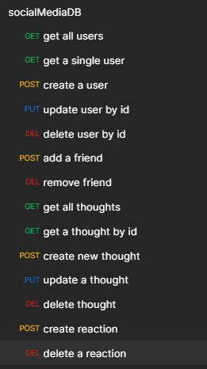

# NoSQL Database: Social Network API (MongoDB/Mongoose)

<svg xmlns="http://www.w3.org/2000/svg" xmlns:xlink="http://www.w3.org/1999/xlink" width="122" height="20" role="img" aria-label="license: MIT License"><title>license: MIT License</title><linearGradient id="s" x2="0" y2="100%"><stop offset="0" stop-color="#bbb" stop-opacity=".1"/><stop offset="1" stop-opacity=".1"/></linearGradient><clipPath id="r"><rect width="122" height="20" rx="3" fill="#fff"/></clipPath><g clip-path="url(#r)"><rect width="47" height="20" fill="#555"/><rect x="47" width="75" height="20" fill="#4c1"/><rect width="122" height="20" fill="url(#s)"/></g><g fill="#fff" text-anchor="middle" font-family="Verdana,Geneva,DejaVu Sans,sans-serif" text-rendering="geometricPrecision" font-size="110"><text aria-hidden="true" x="245" y="150" fill="#010101" fill-opacity=".3" transform="scale(.1)" textLength="370">license</text><text x="245" y="140" transform="scale(.1)" fill="#fff" textLength="370">license</text><text aria-hidden="true" x="835" y="150" fill="#010101" fill-opacity=".3" transform="scale(.1)" textLength="650">MIT License</text><text x="835" y="140" transform="scale(.1)" fill="#fff" textLength="650">MIT License</text></g></svg>

## Description

An API built from the ground up for a social network web application where users can share their thoughts, react to friends’ thoughts, and create a friend list. This was built using [Express.js](https://expressjs.com/) for routing, a [MongoDB](https://www.mongodb.com/docs/) database, and the [Mongoose](https://www.npmjs.com/package/mongoose) ODM. Additionally, the [moment.js](https://momentjs.com/) package was used to easily format dates for the database.

Seed data is provided, once project is installed and the commands are run.

## Table of Contents

- [Preview](#preview)
- [Packages Used](#packages)
- [Installation](#installation)
- [License](#license)
- [Questions](#questions)

## Preview

Video showing what api routes are being used through [Postman](https://www.postman.com/)

https://www.youtube.com/watch?v=WI_ZxmpalYo

## Packages

Project put together using the following libraries/packages:

- [Express.js](https://expressjs.com/)
- [MongoDB](https://www.mongodb.com/docs/)
- [Mongoose](https://www.npmjs.com/package/mongoose)
- [moment.js](https://momentjs.com/)

## Installation

1. After downloading a copy of the repo and making sure you have mongoDB installed on your system, open up your terminal and run the commands:

```
npm install
npm run seed
npm run start
```

2. If the above is successful, then the socialMediaDB database has been created and is now seeded with user and thought data to experiment with. Navigate to POSTMAN, and start testing any endpoints for GET, POST, PUT and DELETE

Overview of all the routes available in this project:



## License

[<svg xmlns="http://www.w3.org/2000/svg" xmlns:xlink="http://www.w3.org/1999/xlink" width="122" height="20" role="img" aria-label="license: MIT License"><title>license: MIT License</title><linearGradient id="s" x2="0" y2="100%"><stop offset="0" stop-color="#bbb" stop-opacity=".1"/><stop offset="1" stop-opacity=".1"/></linearGradient><clipPath id="r"><rect width="122" height="20" rx="3" fill="#fff"/></clipPath><g clip-path="url(#r)"><rect width="47" height="20" fill="#555"/><rect x="47" width="75" height="20" fill="#4c1"/><rect width="122" height="20" fill="url(#s)"/></g><g fill="#fff" text-anchor="middle" font-family="Verdana,Geneva,DejaVu Sans,sans-serif" text-rendering="geometricPrecision" font-size="110"><text aria-hidden="true" x="245" y="150" fill="#010101" fill-opacity=".3" transform="scale(.1)" textLength="370">license</text><text x="245" y="140" transform="scale(.1)" fill="#fff" textLength="370">license</text><text aria-hidden="true" x="835" y="150" fill="#010101" fill-opacity=".3" transform="scale(.1)" textLength="650">MIT License</text><text x="835" y="140" transform="scale(.1)" fill="#fff" textLength="650">MIT License</text></g></svg>](https://choosealicense.com/licenses/mit/)

For more information about the licensing of this project, click the above image or follow this link https://choosealicense.com/licenses/mit/

## Questions

How to get into contact with me?

[My Github Profile](https://github.com/Jon-Ledo)

Email : jonledo.code@gmail.com
